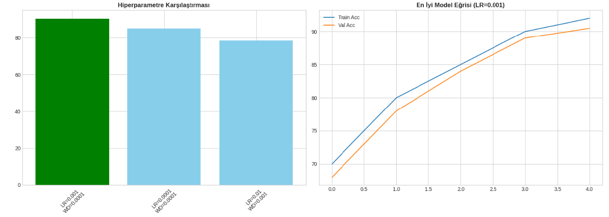
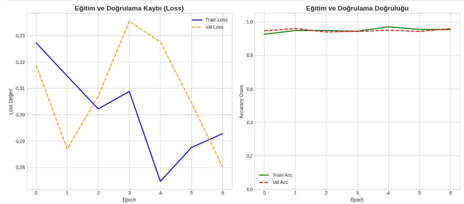
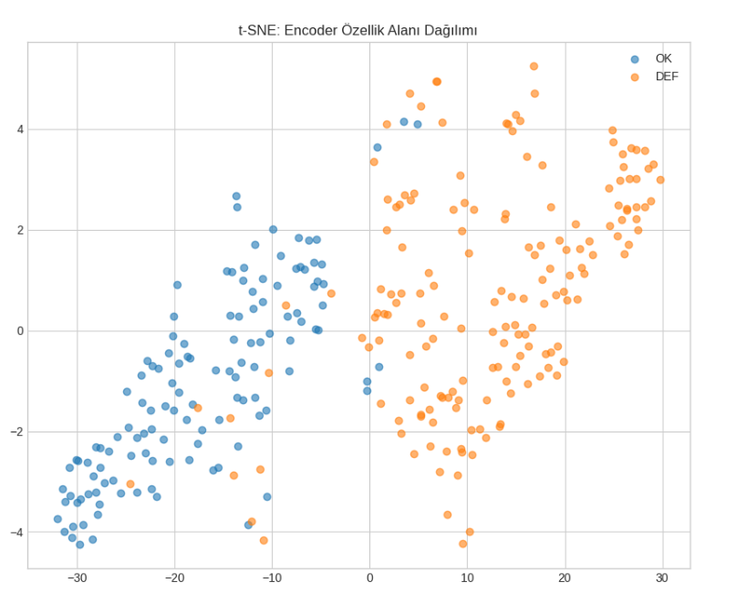
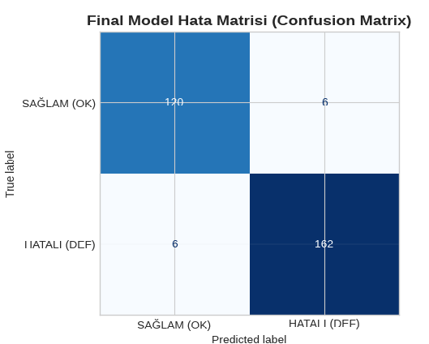
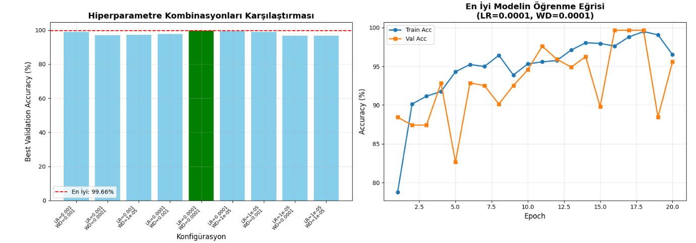

Öz-Denetimli Öğrenme ile Endüstriyel Görüntü Sınıflandırma: SimCLR ve SimSiam Modellerinin Karşılaştırılması

Bu çalışma, endüstriyel döküm yüzey görüntülerinde kusur tespiti problemi için öz-denetimli öğrenme (Self-Supervised Learning, SSL) yaklaşımlarının etkinliğini incelemektedir. Çalışmada SimCLR ve SimSiam modelleri kullanılarak ön-eğitim (pretraining) yapılmış ve elde edilen temsiller denetimli sınıflandırma aşamasında karşılaştırmalı olarak değerlendirilmiştir.

1. Problemin Tanımı

Endüstriyel üretim süreçlerinde yüzey kusurlarının erken ve doğru tespiti kalite kontrol açısından kritik öneme sahiptir. Ancak problem aşağıdaki zorlukları içerir:

Kusurlu örneklerin sayıca az olması → sınıf dengesizliği

Etiketleme süreci maliyetli ve uzman gerektirir

Yüzey dokusu, ışıklandırma ve üretim koşullarına bağlı yüksek görsel varyasyon

Bu nedenle, modelin etiketlere aşırı bağımlı olmadan genel ve ayırt edici görsel temsiller öğrenmesi hedeflenmiş ve öz-denetimli öğrenme yaklaşımları tercih edilmiştir.

2. Kullanılan Veri Seti ve Ön İşleme

Veri Seti: Casting Product Image Dataset  (https://www.kaggle.com/datasets/ravirajsinh45/real-life-industrial-dataset-of-casting-product/code)

Veri seti, endüstriyel döküm yüzey görüntülerinden oluşmaktadır.

Sınıflar: Defect (kusurlu) ve OK (kusursuz)

Ön İşleme:

Görüntüler 224 × 224 boyutuna yeniden ölçeklendirildi

Piksel değerleri normalize edildi

Veri Artırma (Augmentation):

Random horizontal/vertical flip

Rotation

Zoom

SSL aşamasında, her görüntü için iki farklı artırılmış görünüm oluşturularak modelin temsil öğrenmesi sağlanmıştır.

3. Model Mimarisi ve Yaklaşım
   
   
Ortak Encoder

CNN tabanlı encoder kullanıldı

SSL ön-eğitim sonrası sınıflandırma başlığı eklenerek fine-tuning yapıldı

4A. SimCLR

Kontrastif öğrenme temelli SSL

Positive/negative örnek çiftleri kullanır

NT-Xent loss fonksiyonu ile temsil öğrenimi

Avantajları:

Güçlü sınıf ayrımı

Kararlı ve stabil eğitim süreci

Endüstriyel kusur bölgelerinde belirgin özellik çıkarımı

SimCLR Görselleri

SimCLR Ön Eğitim Loss Grafiği: 

Hiperparametre optimizasyonu:

Eğitim süreci grafikleri:

 

t-SNE görselleştirmesi:

 

Test verisi üzerinde tahmin (inference):

Confusion matrix:

 

4B. SimSiam

Negative örnek gerektirmeyen SSL

Stop-gradient mekanizması kullanır

Daha sade ve hafif mimari

Daha kısa eğitim süresi, düşük bellek ihtiyacı, kolay optimizasyon

SimSiam Görselleri

Simsiam Ön Eğitim Loss Grafiği: 

Hiperparametre optimizasyonu:  

  

Eğitim süreci grafikleri:

 

t-SNE görselleştirmesi:

 

Test verisi üzerinde tahmin (inference):
  

Confusion matrix: 

5. Sonuç ve Değerlendirme
   

Elde edilen deneysel sonuçlar, SimSiam modelinin SimCLR’e kıyasla:

Daha yüksek accuracy (%99 vs %95)

Daha güçlü sınıf ayrımı

Daha stabil öğrenme süreci

Daha kısa eğitim süresi

Daha uygun batch size ile verimli çalışması

gibi avantajlar sağladığını göstermektedir. Bu nedenle, endüstriyel kusur tespiti uygulamaları için SimSiam modeli daha uygun bir tercih olarak değerlendirilmektedir.

6. Notebook 

- SimCLR Modeli Eğitimi ve Deneyleri: [SimCLR Model](https://github.com/helinkaraca/repoadi/blob/main/dlfinalsimclrmodel.ipynb)  
- SimSiam Modeli Eğitimi ve Deneyleri: [Simsiam Model](https://github.com/helinkaraca/repoadi/blob/main/dlfinalsimsiammodel.ipynb)
  
7. Proje Sunumu

Çalışmanın metodolojisi, deneysel kurulumları ve sonuçlarının detaylı olarak açıklandığı sunum dosyası:

[Helin KARACA_DLFinalSSL.pdf](https://github.com/helinkaraca/repoadi/blob/main/Helin%20KARACA_DLFinalSSL.pdf)  
 

