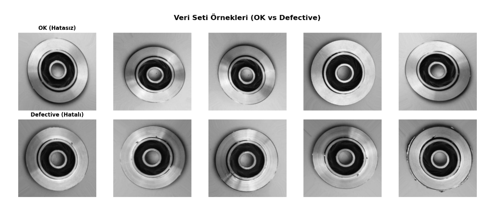
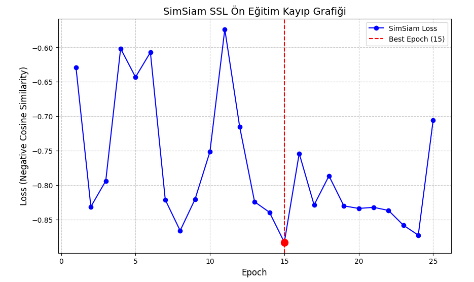
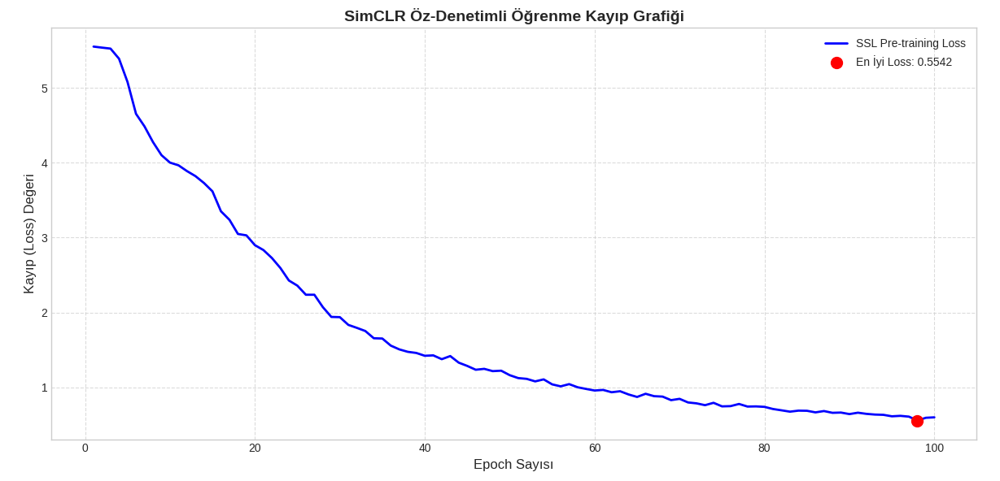
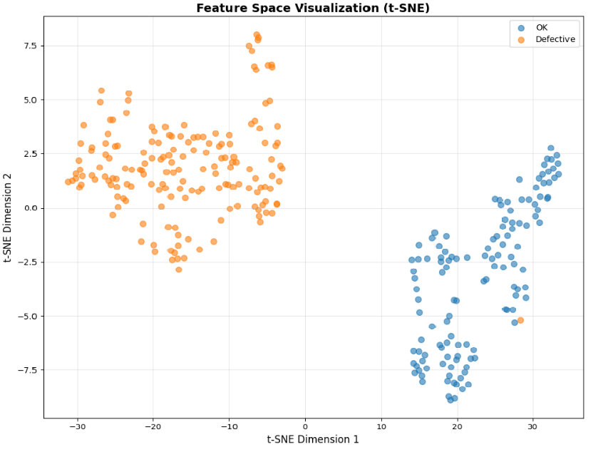
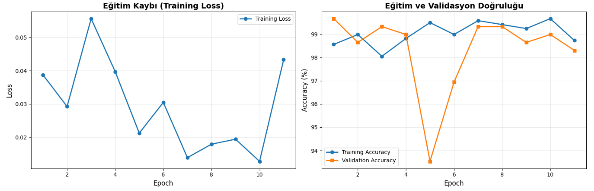
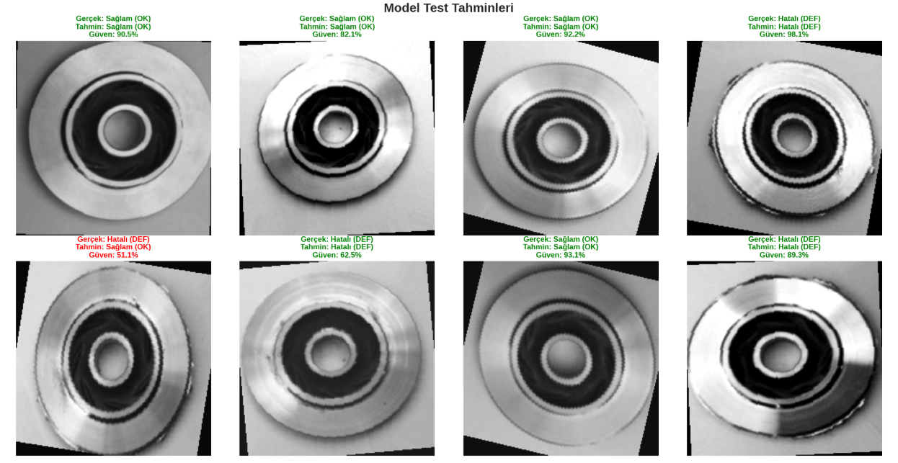
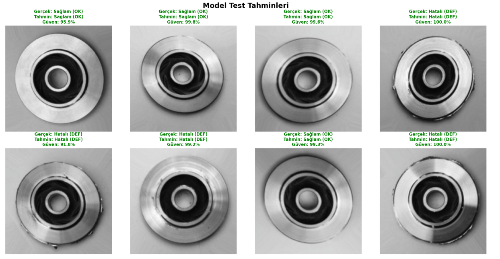
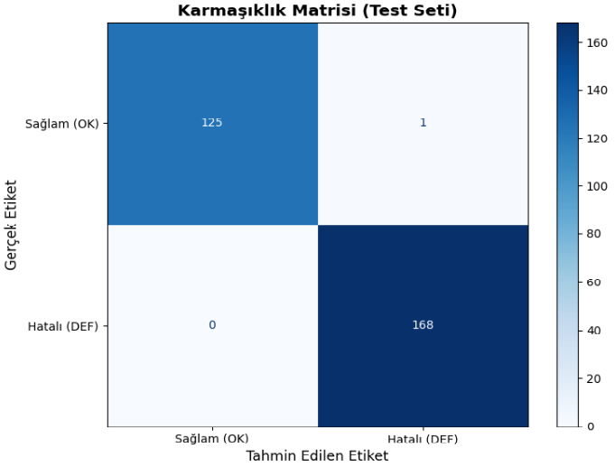

Öz-Denetimli Öğrenme ile Endüstriyel Görüntü Sınıflandırma: SimCLR ve SimSiam Modellerinin Karşılaştırılması

Bu çalışma, endüstriyel döküm yüzey görüntülerinde kusur tespiti problemi için öz-denetimli öğrenme (Self-Supervised Learning, SSL) yaklaşımlarının etkinliğini incelemektedir.
Çalışma kapsamında SimCLR ve SimSiam modelleri kullanılarak ön-eğitim (pretraining) yapılmış ve elde edilen temsiller denetimli sınıflandırma aşamasında karşılaştırmalı olarak değerlendirilmiştir.

1. Problemin Tanımı

Endüstriyel üretim süreçlerinde yüzey kusurlarının erken ve doğru tespiti, kalite kontrol açısından kritik öneme sahiptir.
Ancak bu problem aşağıdaki zorlukları içermektedir:

Kusurlu örneklerin sayıca az olması nedeniyle sınıf dengesizliği

Uzman gerektiren ve maliyetli etiketleme süreci

Yüzey dokusu, ışıklandırma ve üretim koşullarına bağlı yüksek görsel varyasyon

Bu nedenlerle, modelin etiketlere aşırı bağımlı olmadan genel ve ayırt edici görsel temsiller öğrenmesi hedeflenmiş ve öz-denetimli öğrenme yaklaşımları tercih edilmiştir.

2. Kullanılan Veri Seti ve Ön İşleme Adımları
Veri Seti: Casting Product Image Dataset: https://www.kaggle.com/datasets/ravirajsinh45/real-life-industrial-dataset-of-casting-product/code

Kullanılan veri seti endüstriyel döküm yüzey görüntülerinden oluşmaktadır.

İki sınıf:
Defect (kusurlu) ve OK (kusursuz)

Ön İşleme
Görüntüler 224 × 224 boyutuna yeniden ölçeklendirilmiştir.
Piksel değerleri normalize edilmiştir.

Veri Artırma (Augmentation)
Random horizontal/vertical flip
Rotation
Zoom

SSL aşamasında, her görüntü için iki farklı artırılmış görünüm oluşturularak modelin temsil öğrenmesi sağlanmıştır.

3. Model Mimarisi ve Yaklaşımın Gerekçesi
Ortak Encoder
CNN tabanlı bir encoder mimarisi kullanılmıştır.
Encoder, SSL ön-eğitim sonrasında sınıflandırma başlığı eklenerek fine-tuning aşamasında kullanılmıştır.

A. SimCLR

SimCLR, kontrastif öğrenme temelli bir öz-denetimli öğrenme yöntemidir.

Positive ve negative örnek çiftleri kullanır.

NT-Xent loss fonksiyonu ile temsil öğrenimi gerçekleştirir.

Avantajları:
Güçlü sınıf ayrımı sağlayan temsil öğrenimi
Daha kararlı ve stabil eğitim süreci
Endüstriyel kusur bölgelerinde daha belirgin özellik çıkarımı

B. SimSiam
SimSiam, negative örnek gerektirmeyen bir öz-denetimli öğrenme yaklaşımıdır.
Stop-gradient mekanizması kullanır
Daha sade ve hafif bir mimariye sahiptir

Avantajları:
Daha kısa eğitim süresi
Daha düşük bellek ihtiyacı
Uygulama ve optimizasyon açısından daha basit yapı

4. Çalıştırma Talimatları
Ortam ve Bağımlılıklar
Python 3.10+
Gerekli kütüphaneler requirements.txt dosyasında listelenmiştir.

Kurulum:
pip install -r requirements.txt

Eğitim Adımları

SSL Ön-Eğitim:
SimCLR ve SimSiam modelleri ile öz-denetimli ön-eğitim gerçekleştirilir.

   

  

Denetimli Fine-Tuning:
Ön-eğitimli encoder üzerine sınıflandırma başlığı eklenerek eğitim yapılır.

### Notebook 

- SimCLR Modeli Eğitimi ve Deneyleri: [SimCLR Model](https://github.com/kullaniciadi/repoadi/blob/main/dlfinalsimclrmodel.ipynb)  
- SimSiam Modeli Eğitimi ve Deneyleri: [Simsiam Model](https://github.com/kullaniciadi/repoadi/blob/main/dlfinalsimsiammodel.ipynb)

5. Test Çıktıları ve Değerlendirme

SimCLR ve SimSiam modelleri, doğrulama ve test setleri üzerinde karşılaştırmalı olarak değerlendirilmiştir.

Görsel Çıktılar

Ön Eğitim sürecine ait grafikler

    

t-SNE görselleştirmesi

     

Test verisi üzerinde örnek tahmin (inference) görselleri

   

Karmaşıklık matrisi (confusion matrix)

    

Tüm çıktılar outputs/ klasörü altında yer almaktadır.

6. Sonuç ve Değerlendirme
## Sonuçlar

| Metrik               | SimSiam          | SimCLR           |
|----------------------|----------------|----------------|
| En İyi Val Acc       | %99.66          | %95.92          |
| F1-Skoru             | ~%99.6        | %95.85          |

Elde edilen deneysel sonuçlar, Simsiam modelinin:

Daha yüksek genelleme başarımı

Daha güçlü sınıf ayrımı

Daha stabil öğrenme süreci

sağladığını göstermektedir.

Genelleme başarımı ve sınıf ayrım gücü dikkate alındığında, endüstriyel kusur tespiti uygulamaları için Simsiam modelinin daha uygun olduğu sonucuna varılmıştır.

7. Proje Sunumu

Çalışmanın metodolojisi, deneysel kurulumları ve sonuçlarının detaylı olarak açıklandığı sunum dosyası: 

[Helin KARACA_DLFinalSSL.pdf](https://github.com/kullaniciadi/repoadi/blob/main/Helin%20KARACA_DLFinalSSL.pdf)  
 

